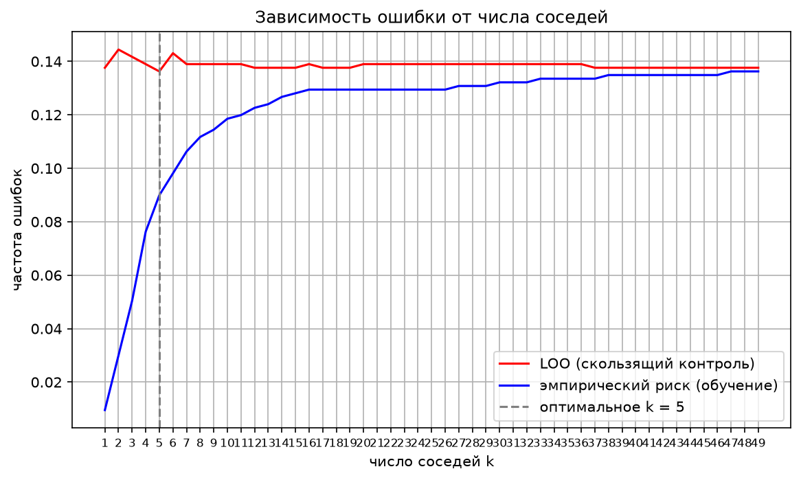

# Лабораторная работа №2. Метрическая классификация

В рамках лабораторной работы предстоит реализовать алгоритм классификации KNN и подобрать параметр k методом скользящего контроля.

В качетсве датасета я взяла набор данных с сайта kaggle: данные по заболеванию сердца. Задача реализовать алгоритм KNN с методом окна Парзена переменной ширины и обосновать выбор параметров алгоритма, построить графики эмпирического риска для различных k.

**Важно:**
- Гипотеза компактности (для классификации):
- Близкие объекты, как правило, лежат в одном классе.

Сначала рассмотрим из чего состоит алгоритм knn с метдом окна переменной ширины.
1) в качестве расстояния я взяла Минковского, потому что это универсальная формула, где метод p подбирается вручную. 

$$
\rho(x, x_i) = \left( \sum_{j=1}^{n} w_j |x^j - x_i^j|^p \right)^{1/p}
$$

Существует понятие *метрического классификатора* - он относит объект x к тому классу, которому принадлежат его ближайшие соседи.

$$
a(x; X^\ell) = \arg\max_{y \in Y} \underbrace{\sum_{i=1}^{\ell} [y^{(i)} = y] \, w(i, x)}_{\Gamma_y(x)}
$$

2) Далее рассчитаем `Ядро` - я взяла Гауссово, потому что плавное убывание.
Ядро K отвечает за форму окна: оно задаёт правило, по которому расстояние до соседа превращается в вес его голоса. Выбор ядра влияет на то, насколько сильно ближайшие соседи доминируют над более далёкими.
В качетсве аппроксимации можно взять гауссово ядро **G (r ) = exp(−2r 2) — гауссовское**. Гауссово ядро - гладкая аппроксимация

$$
K(r) = e^{-2r^2}
$$

3) По заданию надо рассчитать алгоритм парзеновского окна перенной ширины:

$$
a(x; X^\ell, k) = \arg\max_{y \in Y} \; \Gamma_y(x),
\qquad
\Gamma_y(x) = \sum_{i=1}^{\ell} [y_i = y] \; K\!\left( \frac{\rho(x, x_i)}{h(x)} \right)
$$

**Как выбрать K:**
$$
\mathrm{LOO}(k) = \frac{1}{\ell} \sum_{i=1}^{\ell}
\Bigl[ a\bigl(x_i;\, X^\ell \setminus \{x_i\},\, k\bigr) \ne y_i \Bigr],
\qquad
k^* = \arg\min_k \mathrm{LOO}(k)
$$

Объект x_i здесь исключается из обучающей выборки, а потом классифицируется по оставшимся

4)  Оценим качество при одном заданном k: возвратим долю ошибок скользящего контроля

На практике оптимальное значение параметра k определяют по критерию скользящего контроля с исключением
объектов по одному (leave-one-out, LOO):

$$
\mathrm{LOO}(k, X^\ell) = \sum_{i=1}^{\ell} \Bigl[ a\bigl(x_i;\, X^\ell \setminus \{x_i\},\, k\bigr) \ne y_i \Bigr] \to \min_k .
$$

и далее выберем лучшее **k** - Оптимальное k подбирается полным перебором: для каждого k из диапазона считается LOO-ошибка, и выбирается k с наименьшей ошибкой.

Таким образом, лучшее k по LOO это 5, LOO-ошибка: 0.1362. Один объект убирается из выборки, классифицирует по оставшимся и считает долю ошибокостальных. 

5) Далее посчитаем функцию матрицу расстояний Минковского между всеми парами объектов из двух наборов A и B. Расстояне минковского счиатет расстояние от одного объекта, а парное расстоние елает то же самое сразу для всех объектов.

$$
\rho(a, b) = \Bigl( \sum_{j=1}^{n} |a_j - b_j|^p \Bigr)^{1/p}
$$
